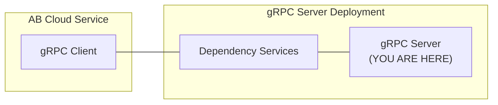

# example-advanced-sample-app-grpc-golang



`AccelByte Gaming Services` capabilities can be extended using custom functions implemented in a `gRPC server`.
If configured, custom functions in the `gRPC server` will be called by `AccelByte Gaming Services` instead of the default function.

The `gRPC server` and the `gRPC client` can actually communicate directly. 
However, additional services are necessary to provide **security**, **reliability**, **scalability**, and **observability**. 
We call these services as `dependency services`. 
The [grpc-plugin-dependencies](https://github.com/AccelByte/grpc-plugin-dependencies) repository is provided 
as an example of what these `dependency services` may look like. 
It contains a docker compose which consists of these `dependency services`.

> :warning: **grpc-plugin-dependencies is provided as example for local development purpose only:** The dependency services in the actual gRPC server deployment may not be exactly the same.

## Overview

This repository contains `sample matchmaking function gRPC server app` written in `Go`, It provides simple custom
matchmaking function implementation for matchmaking service in `AccelByte Gaming Services`. 

This sample app also shows how this `gRPC server` can be instrumented for better observability.
It is configured by default to send metrics, traces, and logs to the observability `dependency services` 
in [grpc-plugin-dependencies](https://github.com/AccelByte/grpc-plugin-dependencies).

## Prerequisites

1. Windows 10 WSL2 or Linux Ubuntu 20.04 with the following tools installed.

   a. bash

   b. make

   c. docker v23.x

   d. docker-compose v2.x

   e. docker loki driver
      
      ```
      docker plugin install grafana/loki-docker-driver:latest --alias loki --grant-all-permissions
      ```

   f. go 1.18

2. Access to `AccelByte Gaming Services` demo environment.

   a. Base URL: https://demo.accelbyte.io

   b. [Create a Game Namespace](https://docs.accelbyte.io/esg/uam/namespaces.html#tutorials) if you don't have one yet. Keep the `Namespace ID`.

   c. [Create an OAuth Client](https://docs.accelbyte.io/guides/access/iam-client.html) with confidential client type with the following permission. Keep the `Client ID` and `Client Secret`.

      - NAMESPACE:{namespace}:MMV2GRPCSERVICE [READ]

## Setup

Create a docker compose `.env` file based on `.env.template` file and fill in the required environment variables in `.env` file.

   ```
   AB_BASE_URL=https://demo.accelbyte.io      # Base URL of AccelByte Gaming Services demo environment
   AB_CLIENT_ID='xxxxxxxxxx'                  # Client ID from the Prerequisites section
   AB_CLIENT_SECRET='xxxxxxxxxx'              # Client Secret from the Prerequisites section
   AB_NAMESPACE='xxxxxxxxxx'                  # Namespace ID from the Prerequisites section
   PLUGIN_GRPC_SERVER_AUTH_ENABLED=false      # Enable or disable access token and permission verification
   ```

> :exclamation: **For the gRPC server and the gRPC client**: Use the same Base URL, Client ID, Client Secret, and Namespace ID.

## Building

To build this sample app, use the following command.

```
make build
```

## Running

To (build and) run this sample app in a container, use the following command.

```
docker-compose up --build
```

## Pushing

To build and push this sample app multi-arch container image to AWS ECR, use the following command.

```
make imagex_push REPO_URL=xxxxxxxxxx.dkr.ecr.us-west-2.amazonaws.com/accelbyte/justice/development/extend/xxxxxxxxxx/xxxxxxxxxx IMAGE_TAG=v0.0.1
```
